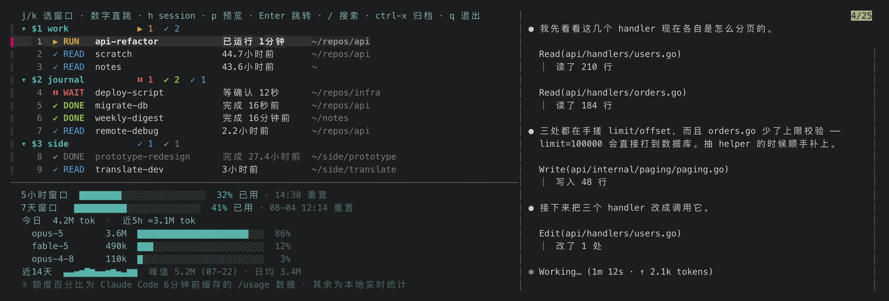
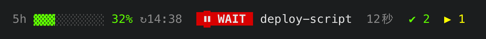

<h1 align="center">claude-tmux-sessions</h1>

<p align="center">
  <b>Run a dozen <a href="https://claude.com/claude-code">Claude Code</a> sessions across tmux — and always know which one needs you.</b>
</p>

<p align="center">
  Hook-driven status tracking for every Claude pane, a persistent alarm for the
  one state that actually stalls you, and a one-key <code>fzf</code> picker with
  a live preview that jumps you straight there.
</p>

<p align="center">
  <a href="LICENSE"></a>
  
  
</p>

<p align="center">
  <b>English</b> · <a href="README.zh-CN.md">简体中文</a>
</p>

<p align="center">
  
</p>

<p align="center">
  <sub><code>prefix + g</code> — 22 tracked panes, collapsed to the nine that
  want you. Rendered by the real scripts against a demo fixture, see
  <a href="docs/demo/">docs/demo</a>.</sub>
</p>

Every row is numbered — press `5`, land on pane 5. The cursor starts on the pane
you're already in, and the right-hand pane shows a **live capture of that
Claude's screen** as you move.

<!--
  Still missing: a ~10s GIF at docs/demo.gif (prefix+g → list appears → j/k down
  two panes, preview following → Enter). The stills carry the README; the motion
  is what V2EX/HN want. Recipe in docs/PROMO.md.
-->


---

## The problem

You keep several Claude Code sessions going in parallel — different tmux windows,
different projects. One's mid-task, one just finished, and one has been
**blocked on a permission prompt for twenty minutes**, quietly stalled, while
you stared at a different window. So you cycle through windows to check who
needs you, which is exactly the bookkeeping a computer should be doing.

This makes that state **ambient**: panes report their own status via Claude Code
hooks, your status line shows the whole picture from any window, and one key
opens a picker that jumps you to the right pane.

There's no daemon and no polling — the hooks fire only when something actually
changes, and the picker reads one small JSON file.

## Four states, read by shape

|  | State | Meaning |
|---|-------|---------|
| `⏸` | **WAIT** | Claude needs an explicit **approve/deny**. It is *stalled*. The only state that notifies you. |
| `▶` | **RUN** | Claude is working. Nothing for you to do. |
| `✔` | **DONE** | Finished, **unread** — a result to go look at. |
| `✓` | **READ** | Finished, and you've already visited it. Quiet. |

Colour carries the same information (red / yellow / green / blue), but the icon
means you can read the list without relying on it.

## What you get

- **A WAIT alarm that won't vanish on you.** A blocked pane paints a white-on-red
  `⏸ WAIT` badge — window name, how long it's been waiting — into your tmux
  status line, and it **re-renders until you deal with it**. Plus a one-shot
  flash, a sound, and a macOS notification. Three channels, because any one of
  them can miss you.
- **One key to the right pane.** `prefix + g` opens an `fzf` list of every
  tracked pane, grouped by session, with a live preview that follows the cursor.
  `Enter` jumps. Or skip the UI entirely: `prefix + W` goes straight to whichever
  pane needs you most.
- **Type-the-number jumps.** Press a row's number to go there. Two-digit rows
  work too (`1` then `2` → pane 12), and single digits still fire instantly when
  they can't begin a bigger number.
- **An inbox, not a dashboard.** Visiting a `DONE` pane marks it `READ`; `ctrl-x`
  archives ones you don't care about. Both come back on their own the next time
  that pane does something new — so the list stays short without you curating it.
- **Scales past a screenful.** The quiet panes — `READ`, and unread `DONE` you
  haven't touched in hours — **collapse by default**, leaving only what's
  actionable, with a line under each session saying exactly what it's holding
  back (`⋯ 收起 3 个(2 已读 · 1 搁置) · a 展开`). A session with only *one*
  quiet pane doesn't collapse at all: that line would take the row it saved.
  `a` expands everything. Row numbers are assigned *before* collapsing, so a
  pane's number never changes when you toggle — it just means visible numbers
  can skip.
- **Session mode.** `h` flips the cursor to session headers, and the preview
  becomes one card per pane in that session: its task line, model, context-window
  meter, and a quote of Claude's last reply — read from each pane's transcript,
  not scraped off the screen. One glance answers "what is everyone up to".
- **Your real usage quota, ambiently.** The status segment and the picker footer
  both show your actual 5h/7d rate-limit windows (from Claude Code's own cached
  `/usage` data), plus live per-model token counts from transcripts.
- **Survives a tmux crash.** Optional [tmux-resurrect](https://github.com/tmux-plugins/tmux-resurrect)
  integration re-runs `claude --resume <session_id>` in each restored pane, so
  your sessions come back — not just empty shells.

## Heads up before you install

- **The UI is in Chinese.** All user-facing strings (`等确认` = waiting for your
  confirmation, `已运行` = running for, `完成` = done) are currently hardcoded
  Chinese, because that's what the author reads. The layout, icons and colours
  are language-neutral and the code is plain, so an English/i18n pass is very
  doable — [issues and PRs welcome](../../issues). Filing this here rather than
  letting you discover it after install.
- **Developed and used daily on macOS.** The macOS-specific parts are isolated to
  two things: the system notification (`terminal-notifier`/`osascript`) and the
  alert sound (`afplay`). Everything else is plain tmux + bash + python3 and
  *should* work on Linux — those two calls fail silently — but that path is
  **untested**, so treat Linux as unverified rather than supported. Reports
  welcome.
- **It writes to your Claude Code config.** `install.sh` symlinks five scripts
  into `~/.claude/hooks/` and merges four hook entries into
  `~/.claude/settings.json`, preserving whatever's already there. If you'd
  rather do that by hand, read `install.sh` first — it's ~100 lines and does
  nothing clever. Uninstall instructions are below.

## Install

```bash
git clone https://github.com/threedaycat/claude-tmux-sessions.git ~/projects/claude-tmux-sessions
~/projects/claude-tmux-sessions/install.sh
```

**Requirements:** tmux, [fzf](https://github.com/junegunn/fzf), python3, and a
Claude Code with hooks support. Optionally
[terminal-notifier](https://github.com/julienXX/terminal-notifier) so clicking
the WAIT notification jumps to the pane.

Then add the tmux binding — the one step the installer leaves to you, since tmux
configs vary. In `~/.tmux.conf` (or `~/.tmux.conf.local` if you use
[gpakosz/.tmux](https://github.com/gpakosz/.tmux)):

```tmux
# prefix + g → the picker, cursor starting on the pane you're currently in
bind g run-shell 'tmux display-popup -w 95% -h 85% -E "CALLER_PANE=#{pane_id} ~/.claude/hooks/claude-tmux-picker.sh"'

# prefix + W → jump straight to whichever pane needs you most, no picker
bind W run-shell '~/.claude/hooks/jump-top.sh'
```

Reload with `tmux source-file ~/.tmux.conf`. Then run `/hooks` once in any
**already-running** Claude Code session so it picks up the new config — freshly
started sessions get it automatically.

For the ambient status segment, splice this into your `status-right`:

```tmux
#(~/.claude/hooks/status-badge.sh)
```

which renders the quota bar, a WAIT badge only while something's blocked, then
counts of unread-done and running:

<p align="center">
  
</p>

### Check it's working

In any Claude Code pane inside tmux, send a prompt, then:

```bash
python3 -c 'import json;print(json.dumps(json.load(open("'"$HOME"'/.claude/tmux-claude-status.json")),indent=2,ensure_ascii=False))'
```

You should see an entry for that pane with `"status": "running"` (or `"done"`
once it finishes). Nothing there? The hooks aren't firing — run `/hooks` in that
session, and check that `~/.claude/settings.json` lists
`tmux_status_update.py`.

### Uninstall

```bash
rm ~/.claude/hooks/{tmux_status_update.py,claude-tmux-picker.sh,jump-top.sh,status-badge.sh,restore-claude.sh}
rm -f ~/.claude/tmux-claude-status.json ~/.claude/tmux-claude-restore.json ~/.claude/tmux-quota-cache.json
```

Then remove the four `tmux_status_update.py` hook entries from
`~/.claude/settings.json` and the bindings from your tmux config.

## Using the picker

- `j` / `k` (or ↑ / ↓) move between panes — session headers are skipped, so every
  stop is a real Claude pane and the preview follows it.
- **A row number** jumps straight there. `/` switches to search-by-name instead
  (`Esc` returns to navigation).
- `h` / `←` enters session mode; `l` / `→` leaves it.
- `a` toggles between "only what needs me" (the default) and every tracked pane.
  Set `CLAUDE_TMUX_SHOW_ALL=1` if you'd rather always start expanded. The pane
  you're currently in is never collapsed, even when it's a quiet one.
- `p` collapses the preview so the list gets the full width — worth it once
  you're tracking a dozen-plus panes and want to scan names and paths. Press it
  again to bring the preview back, or set `CLAUDE_TMUX_PREVIEW_WIDTH` (default
  `50` — an even split, so the preview is about as wide as the pane it's
  showing) to change it.
- `o` opens the overview: one screen for "I'm back — what's the situation".
  **The first line is the answer** — `5 个有结果等你看`, or `没人等你 · 2 个还在跑`
  — and below it, in the order you actually ask: **what needs you** (⏸ WAIT
  first, then unread ✔ DONE, longest-waiting at the top), **what's still
  running**, **your teams** (roster, task counts, and each member's own pane
  state), then the 5h quota, the 7-day window, today's tokens and the 14-day
  sparkline. It renders once and waits — `r` refreshes, `q` returns — and is
  read-only: looking at it marks nothing read.
- `t` opens the token page: an overview of the window (turns, and the four token
  classes as share bars) above a **per-session ranking you can walk**. It sorts
  by **tokens read in** and highlights **mean context per turn**, because cost is
  roughly turns × the context each turn carried and ~98% of the tokens are
  re-reads of existing context — so turn count alone misjudges which session is
  expensive. Sessions are listed by name, not by id — whatever you or your team
  called them, falling back to the session's opening question for ones that never
  got a name. `j`/`k` move and the preview shows that session in full: what it
  was asked to do, where its tokens went, a per-day sparkline, and its live
  screen if it's still open (the tail of its last reply if it isn't). `Enter`
  takes you to that session's pane; on one that has already closed it says so
  and stays put. `1` / `7` switch between today and the last 7 days, `p`
  collapses the preview, `r` recounts, `q` returns to the list.
- `l` on a team lead's row unfolds its teammates so `j`/`k` walk them; `h` on
  one of them folds the team back up. `h`/`l` are already one level out and one
  level in — session mode is the level above panes — and on these two kinds of
  row they just mean one level further. On every other row they do exactly what
  they always did. See below.
- `f` narrows the list to your Agent Teams and the panes on them — only live
  when you actually have a team. `l` is the small version of it: `f` answers
  *who is on which team*, `l` answers *who is on this one*. See below.
- `Enter` jumps · `ctrl-x` archives the highlighted pane · `q` / `Esc` closes.

### Agent Teams

If you run Claude Code teams, the picker names each teammate's pane after the
teammate — its real name instead of the shared window title — and summarises
the team
on the header of the session it's running in — no separate block, since a team
and the session it was spawned in are the same thing. Selecting that header
gives you a two-part preview: the full roster and shared task list on top —
including the members that have no pane to jump to — then the session's own
panes below.

Teammate rows are indented under their lead and are, by default, shown rather
than selected: `j`/`k` step over them and they have no jump number, so a team
costs one stop in the list instead of one per member. The lead is the useful
destination anyway — its teammates are in the same tmux window, a native
pane-switch away.

When you do want to move among them, press `l` on the lead: that one team's
members become stops, `j`/`k` walk them, and `h` folds it back. It is an
excursion rather than a mode to remember you are in — walking out of the team
folds it again, and so does rebuilding the list (`a` / `f` / `ctrl-x`) or
jumping away by number. Use `f` to see every team at once.

The name is printed in the colour Claude Code assigned that teammate, so
saying "this pane is on a team" costs the list no columns at all — the name
column is the one that runs out of room, and a word in front of every member
row was spending a fifth of it to repeat what the session header says once.
Colour is never the only thing carrying it: a teammate row also has no number
in its gutter, `j`/`k` steps over it, and its preview names the team in words.

The team rows cost nothing if you don't use teams: with no `~/.claude/teams/`
directory the picker does a single `stat`, adds no row and annotates none.
`f` is inert and isn't advertised in the header.

One related change does apply to everybody: rows are now named from the pane's
own title rather than its tmux window's. For a pane that has a window to
itself those are the same string and nothing looks different. For several
Claude panes sharing one window they aren't — the window title is all of their
titles concatenated — so those rows now show each pane's own name instead of
the same jumble repeated.

A session you renamed yourself with `/rename` is shown by that name, ahead of
every automatic source. Only names you chose count — Claude Code also
generates one for every session, and a generated name is just the directory,
which the row already tells you at the other end. Nothing changes if you have
never renamed anything.

Point `CLAUDE_TMUX_TEAM_LABELS` at a JSON file (`{"member-name": "word"}`) to
choose the word used for each member's role in the previews. The picker prints
whatever you put there and doesn't interpret it.

## Why not just…

- **…name my tmux windows?** Claude Code already drives your window titles with a
  spinner, so you can see *that* something's running — but not whether it's
  blocked on you, and not without looking at every window. The WAIT alarm is the
  part window names can't do.
- **…use Claude Code's own session list?** It's per-instance and shows sessions,
  not *where they live in tmux*. This is the other direction: pane-first, so
  "jump to it" is one keypress.
- **…just watch for the notification?** macOS notifications are transient and
  easy to miss when you're in another app or another Space. That's precisely why
  the alarm here is a persistent status-line badge that only clears when you go
  deal with it.

## How it works

Claude Code hooks write one file, `~/.claude/tmux-claude-status.json`, keyed by
tmux pane id:

| Hook | Writes |
|------|--------|
| `UserPromptSubmit` | `running` |
| `Stop` | `done` |
| `Notification` | `blocked` (a `permission_prompt`) or `input` (idle) — the hook reads the notification type to tell them apart |
| `SessionEnd` | deletes the entry |

Every reader first *prunes* that file against `tmux list-panes -a`, so closed
panes — and panes that have fallen back to a plain shell because Claude exited —
disappear on their own. The picker (`bin/list-rows.sh` → `fzf`) and the status
badge (`bin/status-badge.sh`) both read it. In the UI, `input` (idle) collapses
into the `DONE`/`READ` pair, and a finished pane you never return to ages out
after `CLAUDE_TMUX_IDLE_STALE_SECS` (default 2h): it leaves the status bar and
sinks, dimmed, to the bottom of the picker.

**Full design** — the notification cascade, the read/archive model, the two
cursor modes and digit accumulator, the live preview and usage footer, glyph
widths and CJK alignment, and the tmux-resurrect integration — is in
**[DESIGN.md](DESIGN.md)**.

## License

MIT
