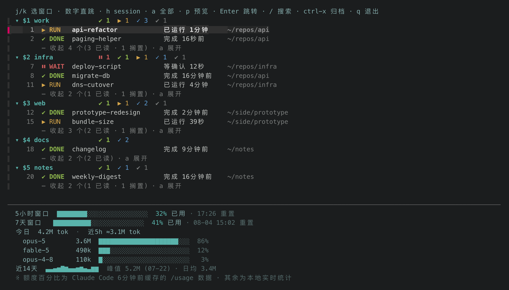

# 我同时开二十多个 Claude Code,最后是被"谁在等我"这件事逼着写了个工具

> **草稿,尚未发布到任何平台。** 图里的**布局是真的、数据是造的**,不得声称那是我的真实
> 工作状态 —— 详见文末[内部备注](#附内部备注发布前删掉这一节)。

<!-- 题图在知乎是单独上传的,正文里不要再放一次:发布时把下面这张删掉 -->


有一次我在一个窗口里改前端,改得挺投入,过了二十分钟切到另一个窗口,发现那边的 Claude 早就
停在一个权限确认上 —— 弹着"要不要执行这条命令",光标闪着,等我按一下同意。

它不是在跑,它是在**干等**。二十分钟,纯属浪费,而且是我造成的。

会有这种事,是因为我同时开着很多个。刚才顺手数了一下:tmux 里 6 个 session、24 个 window,
**25 个 Claude Code 正在跑** —— 每个 window 都占着一个,还有一个窗口里开了两个。一个在重构
API,一个在跑数据迁移,一个在写周报摘要,还有几个是昨天开着忘了关的。

这个用法本身很爽 —— AI 编程真正的杠杆不在"它写得多快",而在"你能同时推几件事"。一个人盯一个
终端,那还是串行,只是打字的人换成了它。

但并行到二十多个之后,那个我没预料到的问题就来了:**我不知道谁在等我。**

## 这种浪费没有反馈

任务失败你会知道,任务跑久了你会知道。但"某个 session 卡在等我点头"这件事,除了你亲自切过去
看一眼,没有任何渠道会告诉你 —— 它没有失败,也没有超时,它就是安安静静地停在那儿。

于是我养成了一个很蠢的习惯:每隔几分钟把所有窗口轮一遍,看看谁停了。

轮询。人肉轮询。这活儿显然该机器干。

## 为什么现成的办法都不够

试过几个方向,都差一点:

**看窗口名。** Claude Code 会把当前状态写进终端标题,tmux 窗口名上能看到一个转圈的 spinner。
问题是它只能告诉你"有东西在动",区分不出"在跑"和"在等你" —— 而这两个状态对你的意义完全
相反。而且你还是得逐个窗口看。

**靠系统通知。** macOS 通知是**瞬时**的。你要是正好在浏览器里,或者切到了另一个桌面
(Space),那条通知飘一下就进通知中心躺着了,等于没发生。偏偏我卡住的时候大概率就在别的
地方干别的事 —— 不然我早看见了。

**用 Claude Code 自己的 session 列表。** 它是 per-instance 的,而且列的是 session,不是
"这个 session 住在 tmux 的哪个 pane 里"。我要的恰好是反方向:从 pane 出发,一键跳过去。

共同的毛病是:这些信息都是**要你去查的**,而我需要的是它**自己在那儿**。

## 于是:四个状态,两个出口

Claude Code 有 hooks —— `UserPromptSubmit`、`Stop`、`Notification`、`SessionEnd`。这几个
钩子刚好能把一个 pane 的生命周期描出来。我让它们各写一次状态,汇进一个小 JSON,按 tmux 的
pane id 做 key:

```json
{
  "%17": { "status": "blocked", "updated_at": 1753941012.4, "read": false,
           "session": "infra", "window_name": "deploy-script" },
  "%29": { "status": "done",    "updated_at": 1753940880.1, "read": true,
           "session": "work",   "window_name": "api-refactor" }
}
```

就这么多。没有数据库,没有常驻进程 —— 后面所有东西都只是在读这一个文件。

状态归成四个,刻意让它们的形状能一眼分开:

- `⏸ WAIT` —— 在等你点同意。**唯一会主动报警的状态**,因为它是唯一真的把你拖住的。
- `▶ RUN` —— 在跑。你没事,别管它。
- `✔ DONE` —— 干完了,你还没看。是一件待办。
- `✓ READ` —— 干完了,你也看过了。安静下去。

颜色也带同样的信息(红/黄/绿/蓝),但图标独立可读 —— 我不想在一屏二十几行的时候被迫靠颜色
分辨。

然后是两个出口。

### 出口一:状态栏上一直挂着

有 pane 卡在 WAIT,tmux 状态栏就挂一条红底白字的 `⏸ WAIT`,带上窗口名和它已经等了多久:


关键在于它**不会自己消失** —— 每次状态栏刷新都重画一次,直到你真的跳过去处理掉。这是我从
"通知飘过去了"那个教训里学到的:告警的价值不在于响一下,在于**它一直在**。

旁边顺手挂了 5 小时 / 7 天的额度条,和"几个完成未读、几个在跑"的计数。

### 出口二:一个键跳到该去的那个

`prefix + g` 弹出一个 fzf 列表,按 session 分组列出所有被追踪的 pane,右边是**光标所在
pane 的实时画面**,`j`/`k` 上下移动预览跟着走,回车跳过去:


每行前面有编号,按 `5` 就直接落到第 5 行。想都不想的时候还有 `prefix + W`,直接跳到"最该被
处理"的那个 pane,连界面都不看。

## 几个我觉得值得说的取舍

**做成收件箱,不是仪表盘。** 一开始我列出所有 pane,结果两天之后列表里躺着一堆早就看过的
"完成",信息密度归零。现在:跳过去看一眼就自动标已读,`ctrl-x` 可以归档掉彻底不关心的。而
这两个标记都会在那个 pane **下次真的做了新事情**的时候自动失效、重新冒头。所以列表能自己
保持短 —— 维护列表这件事一旦需要人做,人就不会做。

**安静的默认收起来。** 到二十几个之后,一屏放不下了。但那些看过的、以及几小时都没管的,本来
就不需要占位置:它们默认折叠,每个 session 底下留一行"收起 N 个",按 `a` 全部展开。行号在
折叠之前就分配好,所以同一个 pane 永远是同一个号,展开收起都不会变。

**"完成"会老化。** 一个跑完了但你一直没去看的 pane,过两小时会自动从状态栏撤下来,在 picker
里变暗、沉到底部。因为一件两小时你都没管的事,大概本来就不急。

**不轮询。** hooks 只在状态真的变化的时候写一次文件,读的人(状态栏脚本、picker)每次先拿
`tmux list-panes -a` 对一遍,把已经关掉的 pane、以及 Claude 退出后退回普通 shell 的 pane
顺手清掉。整套东西是 tmux + bash + python3,没有后台进程,没有定时器。我不想为了看状态额外
养一个会挂、会漏、会吃电的东西。

> **⟨这一句得你自己写,我写不了⟩** 这里缺一段"用下来到底变没变" —— 比如现在还会不会出现
> 干等二十分钟的情况、一天大概被 WAIT 叫住几次、有没有反而被它烦到。三五句,具体的数字或
> 场景就行。这是整篇里唯一无法从代码推出来的部分,也是读者最想看的部分:工具能跑不等于
> 工具有用。

## 它在整套东西里的位置

picker 解决的是很具体的一个问题:**我看不见谁在等我**。它是入口层,只管把我送到该去的那个
pane,别的什么都不管。真正难的在它上面 —— 活该派给谁、什么时候必须拦住人来拍板、外面进来的
消息该落到哪个会话。那些是另外的部件,这篇不展开。

之所以要说这一句:picker 好用的原因恰恰不是它复杂,而是它只干一件事,所以能单独拿出来装。

## 拿来用

代码在这:<https://github.com/threedaycat/claude-tmux-sessions>

```bash
git clone https://github.com/threedaycat/claude-tmux-sessions.git ~/projects/claude-tmux-sessions
~/projects/claude-tmux-sessions/install.sh
```

需要 tmux、fzf、python3。装完自己加两行 tmux 绑定(README 里有),因为大家的 tmux 配置差太多,
这步我没敢代劳。

有一点提前说清楚:**界面目前是中文的**,因为我自己看中文。布局和图标是语言中立的,代码也很
直白,想做英文版不难,欢迎提 issue / PR。

设计细节我另写了一份 DESIGN.md:那个双光标模式的 picker(同一个列表里 `h`/`l` 切换"选 pane"
和"选整个 session")、告警的三重降级、以及 CJK 宽度对齐这种琐碎但很烦的东西。有兴趣可以去翻。

## 这只是第一步

"谁在等我"只是并行工作流里最先撞上的墙。后面还有几个更难的:任务该切多细才不会互相踩、
跨 session 的上下文怎么传、被 compact 打断之后怎么无痛接上。而且 25 个只是现在 —— 我想把
这套推到 100 个会话,到那个量级,今天这些做法哪些还成立、哪些会塌,本身就是后面几篇要写的
东西。

这些零件其实正在长成一套更完整的东西,picker 是其中第一个成熟到能单独拿出来给别人用的。等
整体立住了我会把它讲清楚 —— 不给时间表,做完了自然会写在这里。

如果你也在同时开好几个 Claude Code,欢迎评论里说说你怎么管的。我最想知道的是有没有人找到了
比"看状态栏"更好的办法。

---

# 附:内部备注(发布前删掉这一节)

## ⚠️ 发布口径

**截图的布局是真的,数据是造的。不得声称那是我的真实工作状态。**

三张图都由 `docs/demo/` 的装置生成:真脚本渲染 + 编造的演示 fixture。所以图里每一处对齐、
每一个状态都是工具自己画的,而 22 个 pane、项目名、路径、额度百分比、token 数全是编的 ——
也正因如此不含任何真实项目信息,不用打码。

被问到就直说"数据是演示数据、布局是真实渲染"。别含糊过去,更别让它读起来像"这是我今天的
屏幕"。没人追问不代表可以赌,而这类文章一旦被抓到夸大,技术可信度是一次性耗尽的。

## 定位与口径

- 不是工具发布,是"我怎么并行用 Claude Code"这个系列的第一篇。工具是这篇的主角,但框架留给
  后续(第二篇讲怎么切任务、第三篇讲 handoff/journal 之类)。知乎吃个人经验叙事 + 真实截图,
  不吃 feature list。
- **picker 是主角,不是终点。** 只用"它在整套东西里的位置"那一小段交代上层,点到为止。
  **不要写成"我在做一个宏大系统"的自我介绍** —— 那种文章知乎不买账,而且东西没成型,说大了
  后面难圆。也**不点名字、不给时间表、不剧透没做完的功能**。
- 目标效果:读者看完知道「这个工具能用、它背后还有东西、值得关注这个人」。

## 配图

正文里的三张图都已经是真文件,直接嵌好了,发布时上传同名图片即可:

| 位置 | 文件 | 说明 |
|------|------|------|
| 题图 | `docs/zhihu-cover.png` | 16:9(知乎信息流按这个比例裁)。预览收起、整支舰队占满画面。信息流里唯一露脸的就是它,要能独立说明"这人同时开一大堆而且管得住"。 |
| 出口一 | `docs/statusbar.png` | 状态栏片段:额度条 + 红底 WAIT badge + 计数。 |
| 出口二 | `docs/picker.png` | picker 全貌,含 `⏸ WAIT` 行、老化变暗的 DONE、每个 session 的"收起 N 个"。 |

想再加图的话,还差一张 **session 模式**(按 `h`,预览变成每个 pane 一张卡片:任务行 / 模型 /
上下文用量 / 最后一句回复)。**现在还出不来** —— fixture 的 pane 没有对应的 transcript 文件,
卡片会全是"(还没有回复内容)"。要补就得先在 `stage-demo.sh` 里给每个 pane 造一份 transcript。

## 发布注意

- **知乎不吃硬广。** 全文重心必须是"我遇到了什么问题、怎么想的",工具是结论不是主题。现在
  大概 6:4,别再往工具倾斜。
- **仓库链接放正文中后段**,开头别放。知乎对开头就挂外链的文章限流。
- **发完守着评论区两小时。** 早期回复率直接影响推荐权重,也是最容易拿到真实反馈的窗口。
- **截图不用打码**(演示数据)。要是你想再补真机截图,项目名、路径、公司相关的 window 名都得
  换掉 —— 或者干脆改 `docs/demo/stage-demo.sh` 里的 fixture 重新出图。
- **文里的数字是实测快照,不是印象。** 2026-07-31 测得:25 个 pane 在跑 Claude、24 个
  window、6 个 session。发之前重跑一遍,数字变了就改文:

  ```bash
  tmux list-panes -a -F $'#{pane_current_command}\t#{session_name}\t#{window_index}' \
    | awk -F'\t' '$1 ~ /^[0-9]+\.[0-9]+\.[0-9]+$/' \
    | tee /tmp/c.tsv | wc -l                                   # 跑着 Claude 的 pane
  awk -F'\t' '{print $2":"$3}' /tmp/c.tsv | sort -u | wc -l    # 涉及的 window
  ```

  被追问"你真开这么多?"的时候,能当场跑给对方看,比任何形容词都管用。
- **正文里的 `⏸ ▶ ✔ ✓` 在知乎编辑器里可能被渲染成彩色 emoji**(宽度和颜色都变)。粘完先
  预览一眼,难看就换成纯文字(`WAIT / RUN / DONE / READ`)—— 图里的是终端渲染,不受影响。
- 发完可以把同一批截图复用到 V2EX 那篇(文案见 `PROMO.md`),但**别同一天发**。
